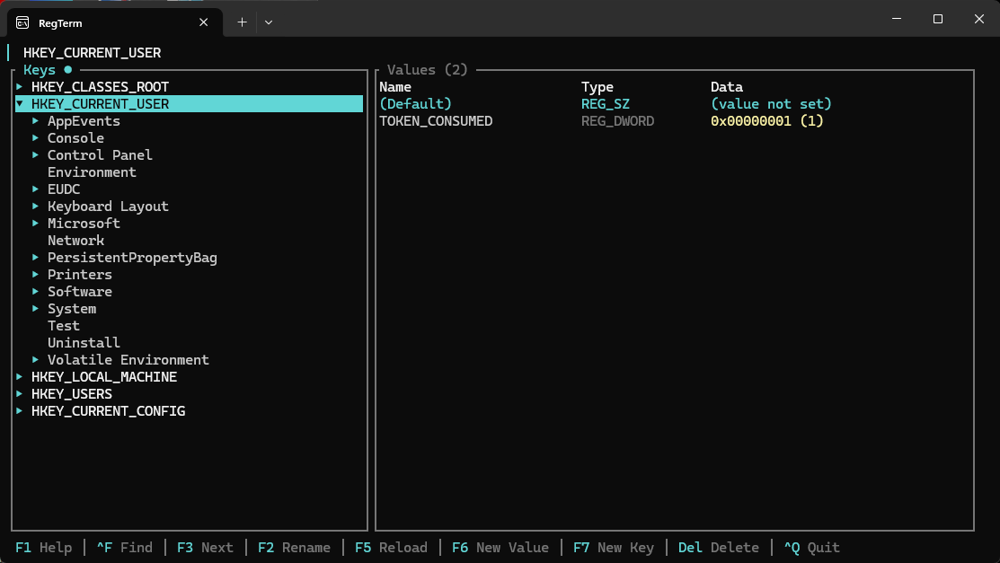
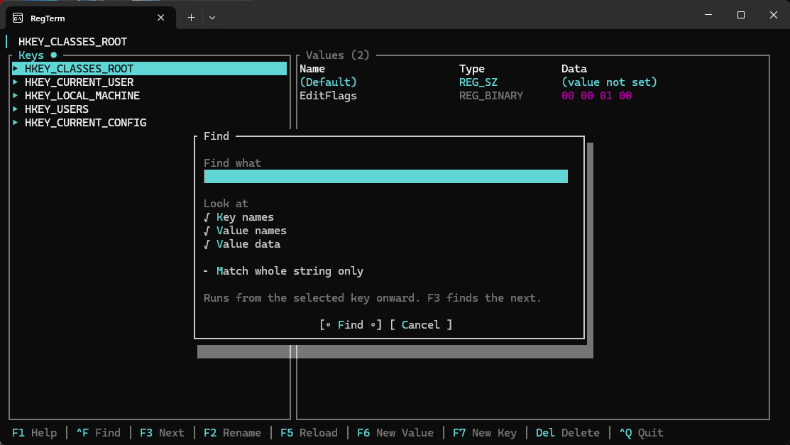

# RegTerm

A registry editor that lives in your Windows terminal. Browse keys, inspect values, make edits, and search without opening `regedit.exe`.



## Give it a go

You'll need Windows and the .NET 10 SDK:

```powershell
dotnet run --project RegTerm
```

Want a standalone exe? Publish the native Windows build:

```powershell
dotnet publish RegTerm -c Release -r win-x64
```

Find `regterm.exe` in `RegTerm/bin/Release/net10.0-windows/win-x64/publish/`. It runs without a .NET runtime installed. Native publishing needs the Visual Studio C++ build tools; if the linker or `vswhere.exe` can't be found, try **Developer PowerShell for Visual Studio**.

## Getting around

Use `Tab` to switch between keys and values. The bar at the bottom shows the main shortcuts, and `F1` opens help in the app.

| Key | What it does |
| --- | --- |
| `↑` / `↓` | Move through the current pane |
| `Enter` | Open a key or edit a value |
| `→` / `←` | Expand or collapse a key; move into or out of it |
| `Space` | Toggle a key open or closed |
| `Backspace` | Go to the parent key |
| Type a name | Jump to a matching key in the keys pane |
| `Ctrl+F` / `F3` | Find something / find the next match |
| `F2` | Rename the selected key or value |
| `F5` | Reload the current key |
| `F6` / `F7` | Add a value / add a key |
| `Del` or `F8` | Delete the selected key or value |
| `Ctrl+Q` | Quit |

Search can look through key names, value names, and value data, starting at the selected key. `F3` picks up where the last search left off.



## Good to know

- Editing `HKEY_LOCAL_MACHINE` and much of `HKEY_CLASSES_ROOT` usually needs an elevated terminal. You can still browse without one.
- Deleting a key deletes everything under it. RegTerm asks before deleting keys or values.
- DWORD and QWORD values can be edited in hex or decimal. For `REG_MULTI_SZ`, separate entries with semicolons; use `\;` for a literal semicolon, `\\` for a backslash, and `\0` for an empty entry.
- `F8` is an alternative to `Del` for terminals that don't pass the Delete key through reliably.

Run the tests with `dotnet test RegTerm.sln`.
